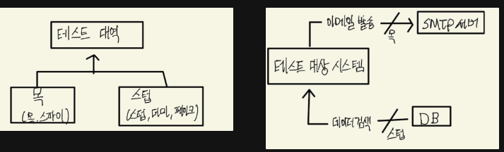

## 다루는 내용

- 목과 스텁 구분
- 식별할 수 있는 동작과 구현 세부 사항 정의
- 목과 테스트 취약성 간의 관계 이해
- 리팩터링 내성 저하 없이 목 사용하기

목과 테스트 취약성 사이에는 깊고 불가피한 관련이 있다. → 알아내야 할 것

리팩터링 내성 저하 없이 목을 사용하는 방법 → 알아내야 . 할것

목이 취약한 테스트 = 리팩터링 내성이 부족한 테스트? 구현에 집중해서 그런가?

### **목과 스텁의 구분**

- 목은 테스트 대역으로써의 목(인스턴스인 mock)과 목 라이브러리의 클래스로써의 목이 있다.

- **테스트 대역**은 테스트를 위해 실제 의존성을 대체하는 가짜 의존성입니다. 이에는 더미, 스텁, 스파이, 목, 페이크 등이 포함되며, 이들은 목과 스텁으로 대분류될 수 있습니다.
- 목은 **외부로 나가는 상호작용을 모방하고 검사**하는 데 사용됩니다.
  - 예를 들어, 어떤 메서드가 **외부 서비스를 호출**해야 할 때, 실제 서비스 대신 목 객체를 사용할 수 있습니다.
  - 해당 서비스가 호출되었는지, 어떤 매개변수로 호출되었는지 등을 검사할 수 있어, 우리가 기대하는 대로 외부와의 상호작용이 이루어지고 있는지 확인합니다.
  - SUT가 **상태를 변경하기 위한 의존성을 호출하는 것**입니다.(쓰기 쿼리를 날리는 느낌)
- 스텁은 **내부로 들어오는 상호작용을 모방**하는 데 사용됩니다.
  - 예를 들어, 어떤 메서드가 DB로부터 데이터를 조회해야 할 때, 실제 DB 대신 스텁 객체를 사용할 수 있습니다.
  - 주어진 입력에 대해 기대하는 출력을 제공하는지 테스트합니다.
  - SUT가 입력 **데이터를 얻기 위한 의존성을 호출하는 것**입니다.(읽기 쿼리를 날리는 느낌)
- 스파이는 목과 같은 역할을 합니다. 목 프레임워크 도움을 받으면 목, 수동으로 작성하면 스파이입니다.
- 스텁, 더미, 페이크의 차이는 얼마나 알고있는지에 있습니다.
  - 더미는 null 값이나 가짜 문자열과 같이 단순하고 하드코딩 된 값으로 최종 결과에 영향을 주지 않습니다.
  - 스텁은 시나리오마다 다른 값을 반환하게끔 구성할 수 있도록 필요한 것을 다 갖춘 완전한 의존성입니다.
  - 페이크는 스텁과 거의 일치하나, 생성에 차이가 있으며 보통 아직 존재하지 않는 의존성을 대체하고자 할 때 구현합니다.

### 스텁 사용법

- 스텁과의 상호작용을 검증하면 취약한 테스트로 이어집니다. 이러한 상호작용은 최종 결과로 가는 중간 단계로 구현 세부 사항에 해당하기 때문입니다.
- 명령 조회 분리(CQS) 원칙에 따르면, 모든 메서드가 명령 또는 조회 중 하나여야 하지만 둘 다는 안됩니다. 명령을 대체하는 테스트 대역은 목이고, 조회를 대체하는 테스트 대역은 스텁입니다.
- 목과 스텁 동시 사용 예시
  - 목과 스텁을 동시에 사용하는 경우는 시스템이 **외부 요청을 보내는 동시에 다른 외부 시스템으로부터 데이터를 조회해야 할 때 발생**할 수 있습니다. 예를 들어, 전자상거래 시스템에서 주문 처리 로직을 테스트하는 경우를 생각해보겠습니다.
    - **목 사용**: 주문이 성공적으로 처리되면, 시스템은 결제 서비스에 결제 요청을 보내야 합니다. 이 결제 요청은 목을 사용하여 모방할 수 있습니다. 목을 사용하면 실제로 결제 서비스를 호출하지 않고도, 결제 요청이 올바른 매개변수로 전송되었는지 검증할 수 있습니다.
    - **스텁 사용**: 주문 처리 로직은 또한 고객의 주문 내역을 조회하기 위해 데이터베이스를 호출할 수 있습니다. 이 데이터베이스 호출은 스텁을 사용하여 모방할 수 있습니다. 스텁을 사용하면 실제 데이터베이스에 접근하지 않고도, 테스트 중인 메서드가 필요한 데이터를 정확히 조회할 수 있음을 보장할 수 있습니다.

### **식별할 수 있는 동작과 구현 세부 사항**

- 테스트 취약성은 리팩터링 내성과 관련이 있으며, 거짓 양성의 주요 이유는 코드의 구현 세부 사항과 결합돼 있기 때문입니다.
- **식별할 수 있는 동작**은 클라이언트가 목표를 달성하는데 도움이 되는 연산이나 상태를 말합니다. 이는 공개 API를 통해 노출되며, 사용자나 다른 시스템에 의미 있는 결과를 제공합니다.
- **구현 세부 사항**은 식별할 수 있는 동작을 제외한 모든 내부 로직이나 데이터 흐름을 의미합니다. 이는 내부적으로만 사용되며, 직접적인 사용자 노출 없이 시스템의 특정 기능을 지원합니다.
- 잘 설계된 코드는 **식별할 수 있는 동작이 공개 API와 일치**하고 구현 세부 사항이 **비공개 API 뒤에 숨겨져 있는 코드**입니다. 공개 API가 식별할 수 있는 동작 이상으로 커지면 코드는 구현 세부 사항을 유출합니다.
- 캡슐화는 코드를 불변성 위반으로부터 보호하는 행입니다. 또한, 구현 세부 사항을 숨김으로써 내부를 손상시킬 위험을 줄일 수 있습니다.

### 육각형 아키텍처

육각형 아키텍처는 애플리케이션의 구조를 설계하는 방법 중 하나로, 애플리케이션의 핵심 로직과 외부 세계와의 상호작용을 분리하는 데 초점을 맞춥니다. 이 아키텍처는 도메인 계층(비즈니스 로직)과 애플리케이션 서비스 계층(도메인 로직과 외부와의 상호작용을 조정)으로 구성됩니다. 이러한 분리는 애플리케이션의 유지 보수성과 테스트 용이성을 높이며, 외부 의존성에 대한 견고한 추상화를 제공합니다.

- 육각형 아키텍처는 애플리케이션을 육각형으로 표현하여, 애플리케이션의 핵심 로직과 외부와의 인터페이스를 분리합니다. 이는 다음 세 가지 주요 관점을 강조합니다
  1. **도메인과 애플리케이션 서비스 계층의 분리**: 비즈니스 로직을 책임지는 도메인 계층과, 외부 애플리케이션과의 연결 역할을 수행하는 애플리케이션 서비스 계층으로 구성됩니다. 이 구조는 각 계층이 서로에게 미치는 영향을 최소화하여, 변경 관리를 용이하게 합니다.
  2. **단방향 의존성 흐름**: 애플리케이션 서비스 계층이 도메인 계층에 의존하되, 도메인 계층은 애플리케이션 서비스 계층이나 다른 외부 요소에 의존하지 않아야 합니다. 이를 통해, 비즈니스 로직의 순수성을 보장하고 재사용성을 높입니다.
  3. **외부와의 인터페이스 표준화**: 애플리케이션 서비스 계층은 외부 애플리케이션과의 통신을 위한 공통 인터페이스를 제공합니다. 이를 통해 외부 애플리케이션은 도메인 로직을 건드리지 않고도 필요한 기능을 사용할 수 있습니다.
- 내부 통신은 애플리케이션 내 클래스나 컴포넌트 간의 상호작용을 의미하며, 주로 구현 세부 사항에 해당합니다. 연산을 수행하기 위한 도메인 클래스 간의 협력은 내부 통신으로 구현 세부 사항에 해당합니다.
- 외부 통신은 애플리케이션이 외부 시스템이나 서비스와 상호작용하는 것을 의미하며, 이는 애플리케이션의 식별 가능한 동작과 직접 관련이 있고, 식별 할 수 있는 동작은 바깥 계층에서 안쪽으로 흐릅니다.

### **목과 테스트 취약성**

애플리케이션 내부와 외부 통신의 차이를 이해하는 것은 테스트 전략을 수립할 때 중요합니다. 내부 통신은 주로 구현 세부 사항에 관련되며, 외부 통신은 애플리케이션의 식별 가능한 동작과 관련됩니다.

- 목을 사용할 때의 **테스트 취약성**은 시스템 내부 통신을 검증하려 할 때 발생합니다. 이는 구현 세부 사항에 초점을 맞추며, 최종 결과와 일치하지 않는 상호작용을 검증하게 됩니다.
- **리팩터링 내성**을 유지하면서 목을 사용하려면, 식별할 수 있는 동작과 시스템 간 통신에 초점을 맞추어야 합니다. 이는 외부에서 확인할 수 있는 결과와 사이드 이펙트에 기반해야 합니다.

### 질문거리

- **Q1:** 목과 스텁을 사용하는 주된 이유와 소프트웨어 개발 과정, 특히 단위 테스트에서 어떻게 가치를 추가하는지?
  목과 스텁은 테스트를 위해 실제 의존성을 대체하는 테스트 대역의 일종입니다. 이러한 도구들을 사용하는 주된 이유는 다음과 같습니다.
  1. **격리된 테스트 환경 생성**: 목과 스텁을 사용하면, 테스트 중인 시스템의 나머지 부분으로부터 의존성을 격리시켜, 특정 기능이나 모듈만을 테스트할 수 있습니다. 이는 단위 테스트가 의도한 대로 정확히 동작하는지 확인하는 데 필수적입니다.
  2. **외부 의존성 제어**: 외부 API, 데이터베이스 호출 등 실제 의존성은 테스트를 불안정하게 만들거나, 테스트 실행 시간을 길게 할 수 있습니다. 목과 스텁을 사용하면 이러한 외부 의존성을 모방하여 테스트가 더 예측 가능하고 신속하게 실행될 수 있습니다.
  3. **테스트 케이스 확장**: 목과 스텁을 사용함으로써, 실제로는 발생하기 어려운 에러 상황이나 예외 케이스를 쉽게 재현하고 테스트할 수 있습니다. 이는 소프트웨어의 견고성을 향상시킵니다.
- **Q2:** 목을 사용하여 테스트 취약성을 방지하기 위한 전략에는 어떤 것들이 있을까?
  1. **식별할 수 있는 동작에 초점 맞추기**: 목을 사용할 때, 시스템의 내부 구현 대신 외부에서 관찰할 수 있는 동작과 결과에 초점을 맞추어야 합니다. 이는 리팩터링 과정에서 내부 구현이 변경되어도 테스트가 깨지지 않도록 합니다.
  2. **과도한 세부 사항 모방 피하기**: 목을 통해 너무 많은 내부 세부 사항을 모방하려 하면, 테스트가 구현에 과도하게 결합되어 취약해질 수 있습니다. 대신, 중요한 상호작용과 결과에 집중합니다.
  3. **명확한 계약 검증**: 목을 사용하여 외부 인터페이스나 API와의 계약을 명확하게 검증함으로써, 시스템 간의 통신이 정확하게 이루어지고 있음을 확인할 수 있습니다.
- **Q3:** 육각형 아키텍처에서 목과 스텁을 활용하는 방법과 그 중요성?
  도메인 로직과 외부 시스템(데이터베이스, 웹 서비스 등) 간의 상호작용을 격리합니다. 이를 통해 도메인 로직을 순수하게 유지할 수 있으며, 외부 의존성의 변화가 도메인 로직의 테스트에 영향을 미치지 않도록 보장합니다.
  1. **애플리케이션 서비스 계층 테스트**: 육각형 아키텍처에서 애플리케이션 서비스 계층은 도메인 로직과 외부 애플리케이션 간의 연결 고리 역할을 합니다. 목과 스텁을 사용하여 이 계층의 로직을 테스트함으로써, 외부 시스템과의 통신이 의도한 대로 작동하는지 확인할 수 있습니다. 이는 통합 오류를 줄이고, 시스템의 안정성을 높이는 데 중요합니다.
  2. **가용성 및 안정성 향상**: 외부 시스템이나 서비스에 대한 의존성으로 인해 발생할 수 있는 실패 포인트를 줄입니다. 실제 외부 서비스가 아닌 목이나 스텁을 사용하여, 외부 서비스의 장애나 네트워크 지연 등의 문제로부터 독립적으로 애플리케이션의 동작을 검증할 수 있습니다.
  3. **테스트 속도와 일관성 개선**: 외부 시스템과의 실제 통신을 요구하는 테스트는 실행 시간이 길어질 수 있고, 외부 시스템의 가용성이나 상태에 따라 테스트 결과가 달라질 수 있습니다. 목과 스텁을 사용하면, 이러한 변수를 제어할 수 있으며, 테스트를 빠르고 일관되게 실행할 수 있습니다.
     육각형 아키텍처에서 목과 스텁의 활용은 시스템의 모듈성을 증가시키고, 도메인 로직의 테스트를 용이하게 만들며, 외부 의존성으로 인한 잠재적 문제로부터 애플리케이션을 보호하는 데 중요한 역할을 합니다. 이러한 접근 방식은 개발자가 더 견고하고 유지보수가 용이한 시스템을 구축하는 데 도움을 줍니다.
