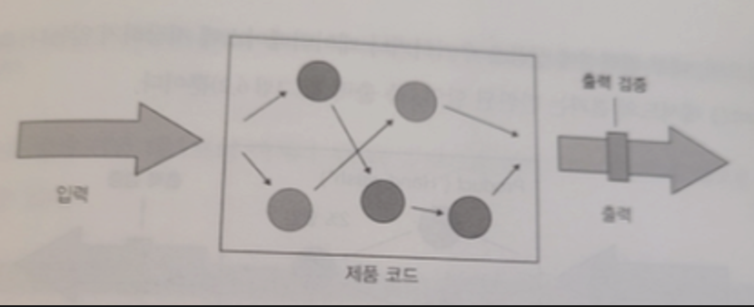
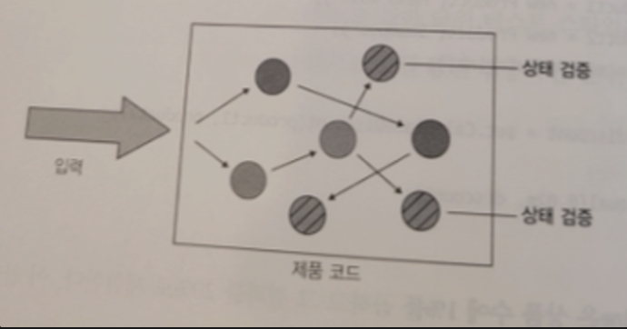
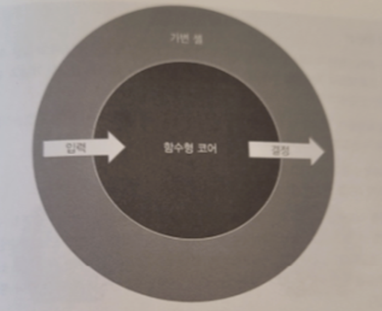

## 다루는 내용

- 단위 테스트 스타일 비교
- 함수형 아키텍처와 육각형 아키텍처의 관계
- 출력 기반 테스트로 전환

## 단위 테스트의 세 가지 스타일

- **출력 기반 테스트:** System Under Test(SUT)에 입력을 제공하고 출력을 확인하는 방식입니다. 구현 세부 사항과의 결합이 거의 없어 리팩터링에 강하고, 작고 간결하여 유지 보수가 용이합니다.



- **상태 기반 테스트:** 작업 완료 후 시스템의 상태를 확인합니다. 비공개 상태를 노출하지 않도록 주의해야 하며, 출력 기반 테스트에 비해 유지 보수가 더 어려울 수 있습니다.
  - 종종 많은 데이터를 확인해야 하므로 크기가 커지는 것을 헬퍼 메서드 혹은 객체의 동등성 비교를 통해 테스트를 단순화 할 수 있다.



- **통신 기반 테스트:** 목(mock)을 사용하여 시스템과 협력자 간의 통신을 검증합니다. 외부 환경에 대한 사이드 이펙트만 확인하며, 가독성이 떨어질 수 있어 유지 보수성이 좋지 않습니다.

|                                         | 출력 기반 | 상태 기반 | 통신 기반 |
| --------------------------------------- | --------- | --------- | --------- |
| 리팩터링 내성을 지키기 위해 필요한 노력 | 낮음      | 중간      | 중간      |
| 유지보수성                              | 낮음      | 중간      | 높음      |

출력 테스트는 두 분파 모두 사용하고, 고전파는 상태 기반 스타일을 런던파는 통신 기반 스타일을 선호한다.

## 함수형 아키텍처와 육각형 아키텍처의 관계

입출력이 숨어있다

```java
public class Text {

	// ... fields
	List<Coemmnt> comments = new ArrayList<>();

	public Comment AddComent(String text) {
		Comment newComment = createComent(text);
		comments.add(newComment); // 사이드 이펙트 -> 숨은 출력

		return comment;
	}
}
```

- **함수형 프로그래밍:** 숨은 입출력이 없는 수학적 함수로 구성된 프로그래밍 방식입니다. 사이드 이펙트와 예외는 숨은 출력으로, 내부 상태나 외부 상태에 대한 참조는 숨은 입력으로 간주됩니다.
  - **사이드 이펙트:** 메서드 시그니처에 표시되지 않는 출력이기에 숨어 있다고 표현합니다. 즉, 해당 연산으로 인스턴스의 상태가 변경되는 것입니다.
  - **예외:** 예외가 발생하면 호출되는 결과 값이 메서드의 리턴 값과 다릅니다. 심지어 호출된 예외는 호출 스택의 어느 곳에서도 발생할 수 있습니다.
  - **내외부 상태에 대한 참조:** LocalDateTime.Now() 처럼 메서드 시그니처에 없는 데이터를 참조하는 것으로 숨어있다고 표현합니다.
- **함수형 아키텍처:** 비지니스 로직과 사이드 이펙트를 분리하며, 사이드 이펙트를 도메인 계층 밖으로 밀어내어 순수 함수 방식의 코드 양을 최대화합니다.
  - 가변 셸은 모든 입력을 수집하여 함수형 코어에 입력 데이터를 제공합니다.
  - 함수형 코어는 수학적 함수를 사용해 구현되며, 애플리에키션에서 모든 결정을 내립니다.
  - 셸은 데이터베이스와 같은 프로세스 외부 의존성에 사이드 이펙트를 적용합니다.
  - 함수형 코어는 출력 기반 단위테스트로, 가변 셸은 훨씬 더 적은 수의 통합 테스트에 맡깁니다.



- **육각형 아키텍처:** 도메인 계층에 한정된 사이드 이펙트를 허용하는 아키텍처입니다. 함수형 아키텍처는 사이드 이펙트를 완전히 도메인 밖으로 밀어내는 점에서 차이가 있습니다.

## 출력 기반 테스트로의 전환

프로세스 외부 의존성을 목으로 변경 → 목에서 함수형 아키텍처로 변경

|               | 초기 버전 | 목 사용 | 출력 기반 |
| ------------- | --------- | ------- | --------- |
| 회귀 방지     | 좋음      | 좋음    | 좋음      |
| 리팩터링 내성 | 좋음      | 좋음    | 좋음      |
| 빠른 피드백   | 나쁨      | 좋음    | 좋음      |
| 유지 보수성   | 나쁨      | 중간    | 좋음      |

- **이점:** 리팩터링에 강하고 유지 보수가 용이합니다. 구현 세부 사항에 결합되지 않으며, 테스트의 명확성과 간결성을 보장합니다.
- **전략:** 출력 기반 테스트의 이점을 활용하기 위해, 함수형 아키텍처와 육각형 아키텍처를 적절히 혼합하여 사용합니다. 이를 통해 사이드 이펙트의 관리와 비즈니스 로직의 분리를 최적화할 수 있습니다.

### 함수형 아키텍처의 단점

- 함수형 아키텍처는 유지 보수성 향상을 위해 성능을 포기한다.
- 함수형 아키텍처는 함수형 코어와 가변 셸을 명확히 분리하기에 코드베이스 크기가 증가한다.
- 함수형 아키텍처와 전통적 아키텍처의 사이 선택은 성능과 코드 유지보수성 사이의 절충에 따라 결정하면 된다.

## 결론

단위 테스트는 소프트웨어 개발 과정에서 매우 중요한 부분입니다. 각 테스트 스타일은 고유의 장단점을 가지고 있으며, 프로젝트의 요구 사항과 팀의 선호에 따라 적절한 스타일을 선택해야 합니다. 함수형 아키텍처와 육각형 아키텍처의 비교를 통해, 사이드 이펙트의 관리와 코드의 유지 보수성 사이에서 균형을 찾는 것이 중요함을 알 수 있습니다. 출력 기반 테스트로의 전환은 이러한 균형을 찾는 데 있어 중요한 역할을 할 수 있습니다.
