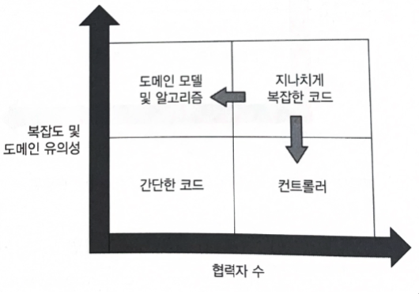
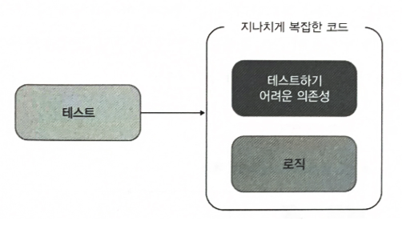
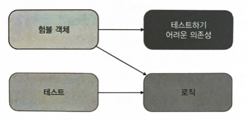
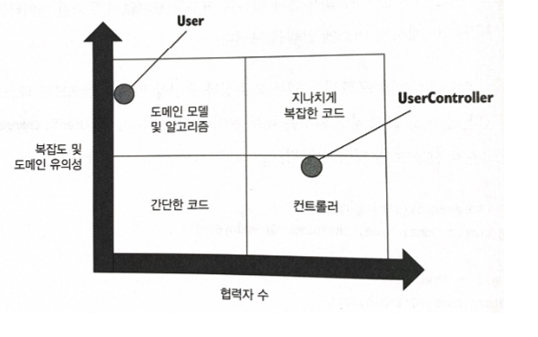
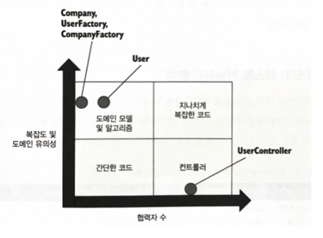
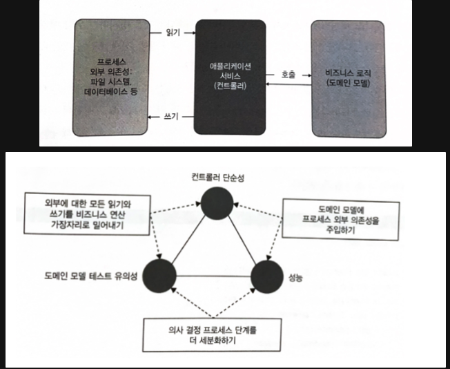
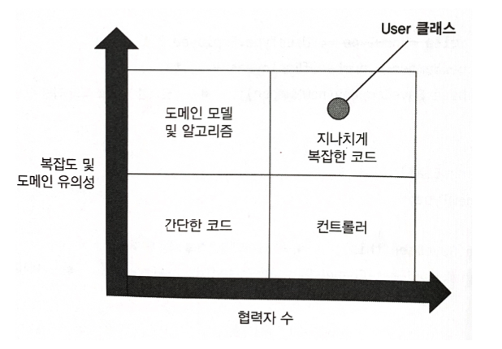

## 다루는 내용

- 네 가지 코드 유형 알아보기
- 험블 객체 패턴 이해
- 가치 있는 테스트 작성

---

이 책의 7장에서는 외부 시스템에 대한 애플리케이션 사이드 이펙트를 추상화하는 과정을 다룹니다. 이는 단위 테스트의 핵심 개념 중 하나로, 코드의 테스트 용이성을 향상시키는 방법에 대해 알아보겠습니다.

## 코드의 복잡도와 도메인 유의성

모든 제품 코드는 2차원으로 분류할 수 있다.

- **복잡도 또는 도메인 유의성**
  - **코드 복잡도(code complexity)**는 코드 내의 의사 결정(분기) 지점 수로 정의한다. 분기가 많을수록 복잡도도 높아진다.
  - **도메인 유의성(domain significance)** : 코드가 프로젝트의 문제 도메인에 얼마나 의미 있는지를 나타낸다. 도메인 계층의 모든 코드는 최종 사용자의 목표와 직접적인 연관성이 있으므로 도메인 유의성이 높다.
- **협력자 수**

**복잡한 코드와 도메인 유의성을 갖는 코드가 단위 테스트에서 가장 이롭다.**

- 해당 테스트는 회귀 방지에 뛰어나기 때문입니다.
- 메인 코드는 복잡할 필요가 없으며, 복잡한 코드는 도메인 유의성이 나타나지 않아도 테스트가 가능합니다.

협력자의 유형도 중요하다.

- 도메인 모델이라면 프로세스 외부 협력자를 사용하면 안 됩니다.
- 목 체계가 복잡하여 유지비가 더 들기 때문입니다. 또한, 리팩터링 내성을 잘 지키려면 상호 작용을 검증하는 하는 것은 애플리케이션 경계를 넘는 상호 작용만 검증하면 됩니다.

**도메인 모델 및 알고리즘을 단위 테스트하면 노력 대비 가장 이롭습니다.** 이러한 단위 테스트는 매우 가치 있고 저렴하고, 해당 코드가 복잡하거나 중요한 로직을 수행해서 테스트의 회귀 방지가 향상되기 때문에 가치 있습니다. 또한, 코드에 협력자가 없어서 테스트 유지비를 낮추기 때문에 저렴합다.

코드 복잡도, 도메인 유의성 협력자 수의 조합으로 네 가지 코드 유형을 볼 수 있다.

- **도메인 모델과 알고리즘(unit)**
- **간단한 코드(x)**
- **컨트롤러(integration)**
- **지나치게 복잡한 코드**

**가장 문제가 되는 코드 유형은 지나치게 복잡한 코드이므로,** 구현할 내용이 더 많더라도 지나치게 복잡한 코드를 알고리즘과 컨트롤러라는 두 부분으로 나누는 것이 좋습니다.

> 코드가 더 중요해지거나 복잡해질수록 협력자는 더 적어야 한다.
>
> 좋지 않은 테스트를 작성하는 것보다는 테스트를 전혀 작성하지 않는 편이 낫다.

## 험블 객체

**지나치게 복잡한 코드를 쪼개려면, 험블 객체 패턴(Humeble Object)을 사용합니다.**

테스트 대상 코드의 로직을 테스트하려면, 테스트가 가능한 부분을 추출해야 합니다. 결과적으로 코드는 테스트 가능한 부분을 둘러싼 얇은 험블 래퍼(humble wrapper)가 됩니다.

육각형 아키텍처와 함수형 아키텍처는 모두 험블 객체 패턴을 정확히 구현합니다.

- 육각형 아키텍처는 비지니스 로직과 프로세스 외부 의존성 간의 통신을 분리하여 도메인 계층과 애플리케이션 서비스 계층이 각각 담당합니다.
- 함수형 아키텍처는 더 나아가 프로세스 외부 의존성과 모든 협력자와의 커뮤니케이션에서 비지니스 로직을 분리합니다. 이는 함수형 코어에는 아무런 협력자도 없으며, 함수형 코어의 모든 의존성이 불변임을 의미합니다.

또한, 험블 객체 패턴을 살펴볼 때 단일 책임 원칙을 지키는 것이 중요합니다. 이 원칙은 각 클래스가 단일한 책임만을 가져야 한다는 것을 의미합니다. 이를 적용하면 비지니스 로직을 거의 모든 것과 분리할 수 있습니다.

테스트 가능한 설계는 테스트를 용이하게 하면서도 유지 보수를 쉽게 해주는 장점을 가지고 있습니다. 이러한 내용을 고려할 때, 테스트 가능한 설계는 소프트웨어의 품질을 향상시키는 중요한 요소입니다.

## **가치 있는 단위 테스트를 위한 리팩터링**

1. **암시적 의존성을 명시적으로 만들기**

   1. 도메인 모델은 직접적으로든 간접적으로든 인터페이스를 통해 프로세스 외부 협력자에게 의존하지 않게 합니다. (이것이 육각형 아키텍처에서 바라는 것으로 즉, 도메인 모델은 외부 시스템과의 통신에 책임이 없어야 한다.)

      

2. **애플리케이션 서비스 계층 도입**

   1. 도메인 모델이 외부 시스템과 직접 통신하는 문제를 극복하려면 다른 클래스인 **험블 컨트롤러**로 책임을 옮깁니다.

      

3. **애플리케이션 서비스 복잡도 낮추기**

   1. 컨트롤러 사분면에 확실히 있기 위해 재구성 로직을 추출합니다.
   2. ORM을 사용해 데이터베이스를 도메인 모델에 매핑하면, 재구성 로직을 옮기기에 적절한 위치가 하면 되고, ORM을 사용하지 않거나 사용할 수 없으면, 도메인 모델에 원시 데이터베이스 데이터로 도메인 클래스를 인스턴스화하는 팩토리 클래스를 작성합니다.

      

4. **새 Company 클래스 소개**
   1. 모든 복잡도가 팩토리로 이동했기 때문에 UserController는 확실히 컨트롤러 사분면에 속하게 되고, 이 클래스의 주요 책임은 모든 협력자를 한데 모으는 것입니다.
   2. 함수형 아키텍처와의 유사점을 살펴보면, 함수형 코어와 위의 도메인 계층은 모두 프로세스 외부 의존성과의 통신을 하지 않습니다. 두 가지 구현의 차이는 부작용 처리에 있습니다.
      1. 함수형 코어는 어떠한 부작용도 일으키지 않습니다.
      2. 반면에 위의 도메인 모델은 부작용을 일으키지만, 이러한 모든 부작용은 변경된 사용자 이메일과 직원 수의 형태로 도메인 모델 내부에 남아있습니다.
      3. 컨트롤러가 User 객체와 Company 객체를 데이터베이스에 저장할 때만 부작용이 도메인 모델의 경계를 넘어갑니다.
   3. 이를 종합하면, 컨트롤러는 협력자를 관리하고, 함수형 코어와 도메인 모델은 부작용을 다루는 방식에서 차이를 보입니다.

**전제 조건을에 대한 테스트가 테스트 스위트에 있을 만큼 충분히 가치 있는가?**

- 규칙은 없지만 도메인 유의성이 있는 모든 전제 조건을 테스트하는 것이 좋다.
  - ex) 직원 수가 음수가 안 된다는 요구 사항에 대한 전제 조건

## **컨트롤러에서 조건부 로직 처리**

- 단어정리
  ### **오케스트레이션(Orchestration)**
  오케스트레이션은 다양한 컴포넌트, 서비스, 시스템이 서로 상호작용하여 특정 비즈니스 프로세스나 워크플로우를 실행하는 방식을 조직, 관리, 조정하는 과정을 말합니다. 이는 마치 오케스트라 지휘자가 다양한 악기를 조화롭게 지휘하는 것에 비유됩니다. 오케스트레이션은 주로 분산 시스템, 마이크로서비스 아키텍처, 워크플로우 관리 등에서 사용됩니다.
  ### **비즈니스 로직(Business Logic)**
  비즈니스 로직은 애플리케이션이 비즈니스 규칙, 연산, 정보 처리를 어떻게 수행하는지 정의합니다. 즉, 실제 비즈니스 문제를 해결하기 위해 데이터를 처리하고 결정을 내리는 코드의 집합입니다.
  ### **비즈니스 로직을 오케스트레이션에서 분리하는 것의 의미**
  비즈니스 로직을 오케스트레이션에서 분리한다는 것은, 비즈니스 로직을 처리하는 코드를 별도의 컴포넌트나 서비스로 분리하고, 오케스트레이션 계층에서는 이러한 컴포넌트나 서비스들이 상호작용하는 방식만을 관리한다는 의미입니다. 즉, 오케스트레이션 계층은 "무엇을" 할 것인지에 대한 결정보다는 "어떻게" 서로 다른 컴포넌트들이 협업하여 목표를 달성할지에 초점을 맞춥니다.

육각형 아케턱처와 함수형 아키텍처는 프로세스 외부 의존성에 대한 모든 참조가 비지니스 연산의 가장자리로 밀려났을 때 가장 효과적입니다.

문제는 다음 세 가지 특성의 균형을 맞추는 것 입니다.

- **도메인 모델 테스트 유의성** : 도메인 클래스의 협력자 수와 유형에 따른 함수
- **컨트롤러 단순성** : 의사 결정(분기) 지점이 있는지에 따라 따름
- **성능** : 프로세스 외부 의존성에 대한 호출 수로 정의

조건부 로직을 처리하면서 동시에 프로세스 외부 협력자 없이 도메인 계층을 유지 보수하는 것은 까다롭고 절충이 필요합니다. 육각형 아키텍처와 함수형 아키텍처는 프로세스 외부 의존성에 대한 모든 참조가 비지니스 연산의 가장자리로 밀려났을 때 가장 효과적입니다.

그러나 위의 세 가지 특성을 모두 충족하는 해법은 없으며, 따라서 두 가지를 선택해야 합니다. 대부분의 프로젝트에서는 성능이 중요하므로

- 첫 번째 방법인 외부에 대한 읽기와 쓰기를 비지니스 연산 가장자리로 밀어내는 것은 고려할 필요가 없습니다. 성능이 떨어지기 때문입니다.
- 두 번째 옵션인 도메인 모델에 프로세스 외부 의존성 주입하기는 코드를 지나치게 복잡한 사분면에 넣기 때문에 피하는 것이 좋습니다.
- **세 번째 옵션인 의사 결정 프로세스 단계를 더 세분화하기는 컨트롤러를 더 복잡하게 만들지만, 이를 완화할 수 있는 방법이 있습니다**.
  - **CanExecute/Execute 패턴**을 사용하면 컨트롤러의 복잡도를 줄일 수 있습니다. 이 패턴을 적용하면 컨트롤러는 비지니스 로직을 이해하지 않고도 연산을 수행할 수 있으며, 도메인 모델의 전제 조건을 충족시키는지 확인할 수 있습니다.
  - **도메인 이벤트**를 사용하여 도메인 모델의 중요한 변경 사항을 추적할 수 있습니다. 이를 통해 컨트롤러의 의사 결정 책임을 줄이고 프로세스 외부 의존성에 대한 테스트를 간결하게 할 수 있습니다.

이러한 접근 방법은 프로세스 외부 의존성에 대한 효과적인 처리와 함께 조건부 로직을 다루는데 도움이 됩니다.

## 결론

도메인의 협력자가 프로세스 외부 의존성을 참조하지 않는 한, 도메인 클래스는 지나치게 복잡한 코드는 아니다.

도메인이 협력자와 상호 작용하는 것을 목으로 사용하여 검증하지 마라. 이 상호 작용은 도메인 모델의 식별할 수 있는 동작과 아무 관련이 없다.
