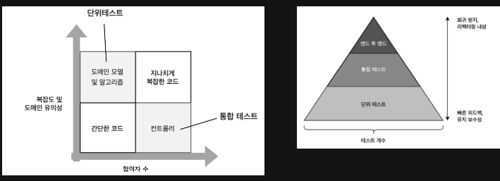

# 다루는 내용

- 통합 테스트의 역할 이해
- 테스트 피라미드의 개념 자세히 살펴보기
- 가치 있는 통합 테스트 작성

## **통합 테스트란?**

통합 테스트는 단위 테스트와 범위 및 목적에 있어서 다릅니다. 단위 테스트가 도메인 모델과 알고리즘에 집중하는 반면, 통합 테스트는 도메인 모델과 외부 의존성을 연결하는 코드를 검증합니다.

- **주요 차이점**: 통합 테스트는 컨트롤러를 대상으로 하며, 단위 테스트는 도메인 모델과 알고리즘을 다룹니다. 너무 단순하거나 복잡한 코드는 테스트에서 제외해야 합니다.
- **테스트 흐름 선택**: 외부 의존성과의 모든 상호작용을 커버하는 주요 흐름을 선택합니다. 이런 흐름이 없다면, 외부 시스템과의 통신을 모두 검증하기 위해 추가적인 통합 테스트를 작성하세요.
- **빠른 실패 원칙**: 예상치 못한 오류가 발생하는 즉시 현재 연산을 중단하는 것을 의미합니다. 이 원칙은 피드백 루프를 단축시키고, 버그가 데이터베이스에 영향을 주어 수정하기 어려운 애플리케이션 상태를 손상시키지 않도록 합니다.

  

## **외부 의존성 직접 테스트**

통합 테스트는 시스템이 외부 의존성과 어떻게 통합하는지를 검증합니다. 실제 외부 프로세스를 사용할지, 아니면 목(mock)으로 대체할지 결정하는 것이 중요합니다. 외부 의존성을 다음 두 가지 범주로 나눕니다:

- **관리 의존성**: 제어할 수 있는 외부 의존성에는 실제 인스턴스를 사용하세요.
  - 이러한 의존성은 애플리케이션에서만 접근 가능하며,
  - 해당 의존성과의 상호 작용은 외부 환경에서 볼 수 없으며, 구현 세부 사항에 해당하고,
  - 대표적으로 DB가 있습니다.
- **비관리 의존성**: 제어할 수 없는 외부 의존성에는 목을 사용하세요.
  - 해당 의존성과의 통신은 시스템의 식별할 수 있는 동작이고,
  - 다른 애플리케이션에서 볼 수 있는 사이드 이펙트를 발생시킵니다.

통합 테스트에서 관리 의존성을 실제 인스턴스로 사용하면 외부 클라이언트 관점에서 최종 상태(칼럼 이름 변경, DB 이관 등)를 확인할 수 있습니다.

다른 애플리케이션이 접근할 수 있는 데이터베이스는 관리 의존성이면서 비관리 의존성입니다. 이러한 경우 두 부분을 구분하는 것이 중요합니다. 외부 애플리케이션에서 볼 수 있는 데이터 베이스 부분을 비관리 의존성으로 처리하고, 통합테스트에서 목으로 대체합니다. 나머지는 데이터베이스의 관리 의존성이 되고, 이 때는 상호작용이 아닌 최종 상태를 검증하세요.

> 만약 통합 테스트에서 실제 데이터베이스를 사용할 수 없다면 통합 테스트를 아예 작성하지 말아라. 도메인 모델의 단위 테스트에만 집중해야 한다. 가치가 충분하지 않은 테스트는 테스트 스위트에 있어서는 안 된다.

통합테스트: 관리 의존성을 실제 인스턴스를 사용하고, 비관리 의존성은 목으로 대체
→ 테스트의 보호 수준이 E2E 테스트와 비슷해진다.

E2E 테스트: 어떤 프로세스 외부 의존성이라도 목으로 대체하지 않고 실제 인스턴스 사용.
→ E2E 테스트 사용 여부는 각자의 판단에 맡긴다.

> |Tip|
> 테스트는 준비 구절에서 사용자와 회사를 데이터베이스에 삽입하지 않고, CreateFactory를 만들어 헬퍼 메서드를 호출한다. 이러한 메서드는 여러 통합 테스트에서 재사용할 수 있다.
> Fixture처럼 사용하는건가?

[OCP vs YAGNI](https://enterprisecraftsmanship.com/posts/ocp-vs-yagni)

## 의존성 추상화를 위한 인터페이스 사용

**진정한 추상화는 발견하는 것이지, 발명하는 것이 아니다.**

진정한 추상화는 발견의 과정입니다. 인터페이스는 적어도 두 가지 이상의 구현이 있을 때만 진정한 추상화로 간주됩니다. 외부 프로세스 의존성에 인터페이스를 사용하는 이유는 비관리 의존성에 대해 목을 사용하기 위함입니다. 즉, 비관리 의존성만 목으로 처리하므로 비관리 의존성만 인터페이스를 사용하는 것이 좋습니다.

## **통합 테스트 모범 사례**

- **도메인 모델 경계 명시**: 도메인 모델의 범위를 명확히 하여 단위 테스트와 통합 테스트를 쉽게 구분할 수 있게 합니다.
- **애플리케이션 내 계층 줄이기**: 코드 이해와 유지보수를 단순화하기 위해 애플리케이션의 계층을 가능한 적게 유지합니다.
  - 대부분 백엔드에서는 세 가지만 활용.
  - 도메인 계층은 도메인 로직 포함
  - **애플리케이션 서비스 계층**은 외부 클라이언트에 대한 진입점 제공 및 도메인 클래스와 프로세스 외부 의존성 간의 작업 조정
  - **인프라 계층**은 도메인 모델에 속하지 않은 알고리즘과 프로세스 외부 의존성과 작동
- **순환 의존성 제거**: 코드의 이해와 유지 관리를 복잡하게 만드는 순환 의존성을 피합니다.

### **결론**

통합 테스트는 소프트웨어 시스템의 구성 요소들이 예상대로 함께 작동하는지를 보장하는 데 중요한 역할을 합니다. 빠른 실패 원칙을 준수하고, 외부 의존성에 대해 실제 인스턴스 사용과 목 대체 사이에 적절한 선택을 하며, 테스트 설계와 유지 보수에 있어 모범 사례를 적용함으로써, 개발자들은 소프트웨어의 신뢰성과 품질을 향상시키는 강력한 통합 테스트 스위트를 생성할 수 있습니다.
