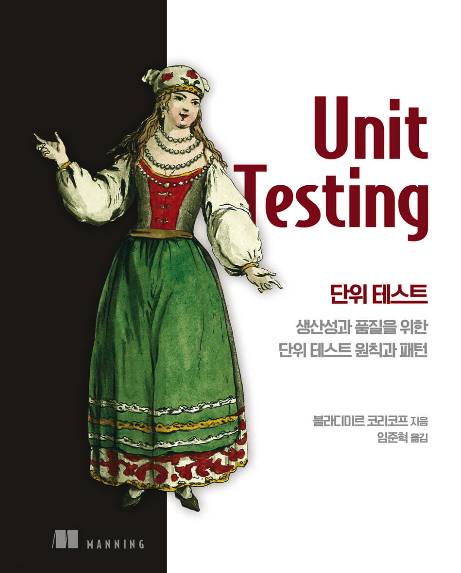

# Unit Testing(단위 테스트)

## 스터디 규칙

- 개요

  - 책 읽기 -> 정리 -> 토론
  - 토론 품질을 올리기 위해서
    - 사례 찾기
    - 반대 의견을 만들어보기

- 일정

  - 매주 금요일 오후 10시 ~ (최대 2시간)
  - 매주 한 챕터씩

- 진행

  - [룰렛](https://lazygyu.github.io/roulette/)으로 발표자(호스트) 1명 선정
  - 선정된 발표자(호스트)는 자신이 정리한 내용 발표

- 블로그(미정)

- 최소한의 벌금(?)
